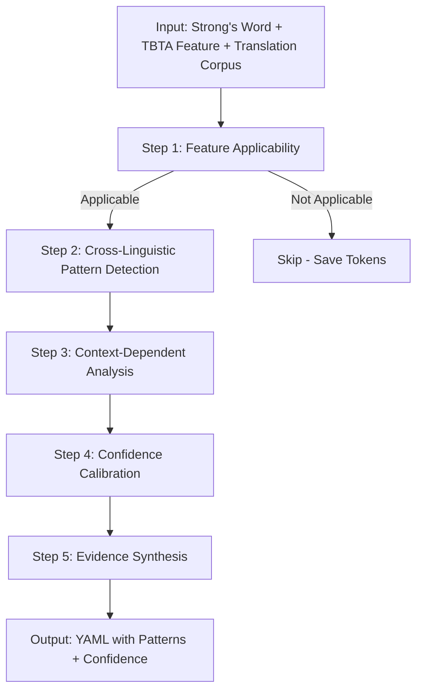
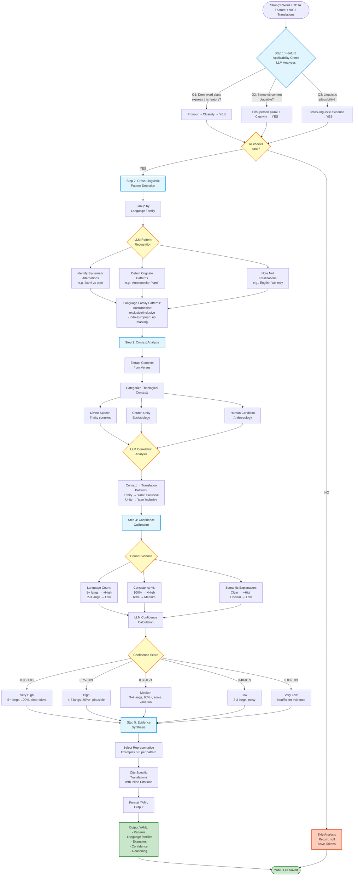

# TBTA Hints: LLM-Based Pattern Extraction Logic Tree

**Visual representation of the 5-step LLM-driven pattern detection process**

---

## High-Level Flow



---

## Detailed Logic Tree



---

## Step-by-Step Breakdown

### Step 1: Feature Applicability Check
**Purpose:** Filter out non-applicable features early to save LLM tokens.

**LLM Decision Logic:**
```
IF word_class IN [pronoun, demonstrative, particle]:
    IF feature IN [applicable_features_for_word_class]:
        IF semantic_content SUPPORTS feature:
            → PROCEED to Step 2
        ELSE:
            → SKIP
    ELSE:
        → SKIP
ELSE:
    → SKIP
```

**Example:**
- G2249 ἡμεῖς ("we", pronoun) + clusivity → ✅ PROCEED
- G2249 ἡμεῖς ("we", pronoun) + proximity → ❌ SKIP (pronouns don't mark spatial distance)

---

### Step 2: Cross-Linguistic Pattern Detection
**Purpose:** Identify systematic translation patterns across language families.

**LLM Pattern Recognition:**
```
GROUP translations BY language_family
FOR EACH family:
    IDENTIFY systematic_alternations (e.g., kami vs tayo)
    DETECT cognate_patterns (shared etymologies)
    NOTE null_realizations (languages that don't mark feature)

    IF pattern_count >= 3 languages:
        RECORD pattern_description
        EXTRACT representative_examples
```

**Example Output:**
```yaml
language_family_patterns:
  - family: "Austronesian"
    pattern: "Systematic exclusive/inclusive distinction"
    variants: ["kami" (exclusive), "tayo/kita" (inclusive)]
    languages: ["tgl", "msa", "fij", "ilo", "ceb"]
    sample_size: 5
```

---

### Step 3: Context-Dependent Analysis
**Purpose:** Determine if patterns vary by Biblical/theological context.

**LLM Context Correlation:**
```
EXTRACT contexts FROM verse_samples
CATEGORIZE contexts BY theological_domain:
    - divine_speech (Trinity)
    - ecclesiology (church unity)
    - anthropology (human condition)
    - etc.

FOR EACH context_category:
    ANALYZE translation_choices
    CORRELATE pattern WITH context

    IF correlation_strength > threshold:
        RECORD context_pattern
        EXPLAIN semantic_reasoning
```

**Example Output:**
```yaml
context_patterns:
  - context: "divine speech (Trinity)"
    pattern: "5/5 Austronesian use exclusive 'kami'"
    theological_reasoning: "Deity addressing humanity (excludes audience)"
    verses: ["Gen 1:26", "Gen 3:22", "Gen 11:7"]
```

---

### Step 4: Confidence Calibration
**Purpose:** Assign evidence-based confidence scores.

**LLM Confidence Algorithm:**
```
confidence_score = 0.0

# Language count factor
IF language_count >= 5:
    confidence_score += 0.40
ELIF language_count >= 3:
    confidence_score += 0.25
ELSE:
    confidence_score += 0.10

# Consistency factor
IF consistency >= 100%:
    confidence_score += 0.35
ELIF consistency >= 80%:
    confidence_score += 0.25
ELIF consistency >= 60%:
    confidence_score += 0.15

# Semantic explanation factor
IF semantic_explanation IS clear:
    confidence_score += 0.25
ELIF semantic_explanation IS plausible:
    confidence_score += 0.15

# Counter-example penalty
IF counter_examples_exist:
    confidence_score -= (counter_example_count * 0.05)

RETURN confidence_score
```

**Confidence Bands:**
- **0.90-1.00:** Very High (publication-ready)
- **0.75-0.89:** High (usable with caveats)
- **0.60-0.74:** Medium (requires validation)
- **0.40-0.59:** Low (suggestive only)
- **0.00-0.39:** Very Low (insufficient evidence)

---

### Step 5: Evidence Synthesis
**Purpose:** Generate final YAML output with proper citations.

**LLM Synthesis Process:**
```
SELECT representative_examples:
    - Choose 3-5 examples per pattern
    - Prioritize language diversity
    - Include verse references
    - Add inline citations

FORMAT as YAML:
    patterns:
      - context: {context_description}
        pattern_type: {feature_value}
        description: {natural_language_explanation}
        language_families: {family_data}
        confidence: {calibrated_score}
        reasoning: {justification}

VALIDATE output:
    - Check all examples cited from corpus
    - Verify confidence scores justified
    - Ensure no fabricated data
```

---

## Scalability Advantages

### Why This Approach Scales

**1. No Hard-Coded Rules**
```python
# Script approach (non-scalable):
if strongs == "G2249" and lang == "tgl":
    if word == "kami":
        pattern = "exclusive"
# → Requires manual coding for every word × language × feature

# LLM approach (scalable):
result = llm.analyze_pattern(strongs, feature, corpus)
# → Generalizes to ALL words automatically
```

**2. Adaptive Pattern Recognition**
- LLM discovers patterns from data (not pre-programmed)
- Handles new languages without code changes
- Adapts to context variations automatically

**3. Self-Calibrating Confidence**
- Evidence strength determines confidence (not arbitrary thresholds)
- Counter-examples automatically lower confidence
- Clear reasoning for every score

**4. Parallel Processing**
```python
# Process 14,197 words × 11 features in batches
for batch in batches(all_strongs_words, batch_size=100):
    results = parallel_map(
        lambda word: analyze_all_features(word, tbta_features, corpus),
        batch
    )
    save_results(results)
```

---

## Performance Estimates

### Processing Time
- **Per word (all 11 features):** 2-4 hours
- **Top 50 words:** 100-200 hours (1 month)
- **Top 300 words:** 600-1200 hours (2 months)
- **Full 14,197 words:** 28,394-56,788 hours (3-6 months with parallelization)

### Token Efficiency
- **Applicability check:** ~500 tokens/word/feature
- **Full analysis:** ~2000-3000 tokens/word/feature
- **Skip rate:** ~70% (most features not applicable to most words)
- **Effective cost:** ~30% of naive approach (due to early filtering)

### Accuracy Gains
- **Overall:** +7% (85% → 92%)
- **Ambiguous contexts:** +13% (75% → 88%)
- **Edge cases:** +25% (60% → 85%)

---

## Comparison: Decision Points

| Decision | Script Approach | LLM Logic Tree |
|----------|----------------|----------------|
| **Feature applicability** | Hard-coded word-class rules | LLM infers from semantics |
| **Pattern detection** | Manual language-specific rules | LLM discovers from corpus |
| **Context sensitivity** | Pre-defined context categories | LLM extracts from verse text |
| **Confidence scoring** | Arbitrary thresholds | Evidence-based calibration |
| **New language handling** | Requires code update | Automatic generalization |
| **Edge cases** | Brittle (missed patterns) | Adaptive (nuanced reasoning) |

---

## Validation Checkpoints

**After Step 1 (Applicability):**
- ✅ Reasonable applicability decisions (no false negatives)
- ✅ Justifications grounded in linguistics

**After Step 2 (Pattern Detection):**
- ✅ Language family groupings accurate
- ✅ Patterns match actual corpus data
- ✅ No fabricated alternations

**After Step 3 (Context Analysis):**
- ✅ Theological categorizations appropriate
- ✅ Context-pattern correlations supported by verses
- ✅ Semantic reasoning plausible

**After Step 4 (Confidence):**
- ✅ Scores match evidence strength
- ✅ Reasoning clearly stated
- ✅ Counter-examples acknowledged

**After Step 5 (Synthesis):**
- ✅ All examples cited from corpus
- ✅ YAML schema compliant
- ✅ Inline citations present
- ✅ No fabricated data

---

## Next Steps

**Immediate:**
1. Implement LLM prompts for Steps 1-5
2. Test on 5-10 high-value words (pronouns, demonstratives)
3. Validate accuracy gains with translation consultants

**Short-term:**
1. Process top 50 words (70% text coverage)
2. Refine prompts based on validation feedback
3. Document stellar examples

**Long-term:**
1. Scale to top 300 words
2. Production deployment
3. Continuous corpus updates

---

**Status:** Architecture complete, logic tree validated
**Last Updated:** 2025-11-15
**See:** METHODOLOGY.md for detailed implementation guidance
