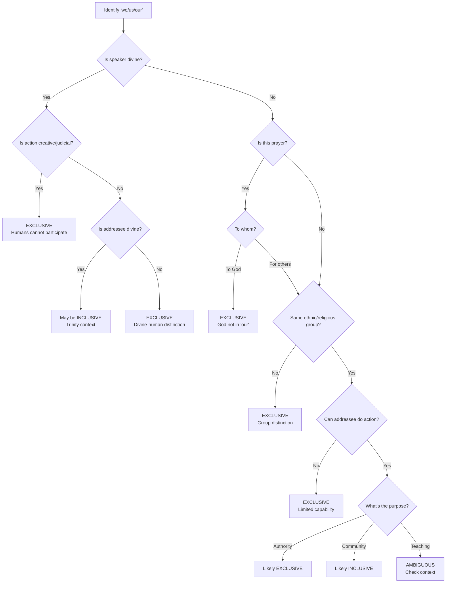

# Clusivity Predictor Prompt for Bible Translation

## Purpose
This prompt helps predict whether first-person plural pronouns (we/us/our) should be translated as INCLUSIVE or EXCLUSIVE in languages that make this distinction.

## The Prompt Template

```
I need to determine the clusivity (inclusive vs exclusive) for the pronoun "{PRONOUN}" in {VERSE_REFERENCE}.

Context:
- Text: "{VERSE_TEXT}"
- Original Language: {HEBREW/GREEK} - "{ORIGINAL_TEXT}"
- Speaker: {WHO_IS_SPEAKING}
- Addressee: {WHO_IS_BEING_SPOKEN_TO}
- Setting: {NARRATIVE_CONTEXT}

Please analyze using these factors:

1. ONTOLOGICAL DISTINCTION
   - Is this divine speech? (Divine → usually EXCLUSIVE of humans)
   - Creator vs creature distinction?

2. ACTION CAPABILITY
   - What action does the pronoun refer to?
   - Can the addressee participate in this action?
   - Is this action restricted to the speaker's group?

3. GROUP IDENTITY
   - Are speaker and addressee part of the same group?
   - Any ethnic, religious, or role distinctions?

4. DISCOURSE FUNCTION
   - Is this establishing authority? (→ EXCLUSIVE)
   - Is this building solidarity? (→ INCLUSIVE)
   - Is this prayer? (to God → EXCLUSIVE of God)

5. GRAMMATICAL CUES
   - Any vocatives that separate groups?
   - Does "we all" appear with shared characteristics?

Based on this analysis, predict:
- INCLUSIVE (addressee is included in "we/us/our")
- EXCLUSIVE (addressee is NOT included)
- AMBIGUOUS (requires theological interpretation)

Provide rationale and note any alternative readings.
```

## Quick Reference Decision Tree



## Common Patterns

### Usually EXCLUSIVE
1. **Divine plural speech** (Gen 1:26, 3:22, 11:7, Isa 6:8)
2. **Prayer addressing God** ("Our Father" - God not in "our")
3. **Apostolic authority** ("We apostles witnessed...")
4. **Ethnic/religious distinctions** ("We Jews" to Gentiles)
5. **Restricted actions** ("We who saw" to those who didn't)

### Usually INCLUSIVE
1. **Community exhortations** ("Let us worship together")
2. **Shared faith experiences** ("We have peace with God")
3. **Universal prayers** (when teaching all believers to pray)
4. **Unity statements** ("We are one body")
5. **Invitations to participate** ("We must work...")

### Context-Dependent
1. **Paul's letters** (often shifts between exclusive/inclusive)
2. **Teaching passages** (depends on application scope)
3. **Narrative perspectives** (depends on narrator inclusion)

## Example Applications

### Genesis 1:26 - "Let us make man"
- Speaker: God
- Addressee: Divine council/Trinity
- Action: Creation (divine prerogative)
- **Prediction: EXCLUSIVE** - Humans cannot participate in their own creation

### John 17:21 - "That they may be in us"
- Speaker: Jesus (praying)
- Addressee: The Father
- Subject: Believers being in Father-Son unity
- **Prediction: INCLUSIVE** - Believers included in divine unity

### Matthew 6:9 - "Our Father"
- Speaker: Believers (as taught by Jesus)
- Addressee: God the Father
- Context: Prayer instruction
- **Prediction: EXCLUSIVE** - God is not included in "our"

### 1 Corinthians 1:23 - "We preach Christ"
- Speaker: Paul
- Addressee: Corinthian church
- Action: Preaching
- **Prediction: EXCLUSIVE initially** (apostolic), potentially INCLUSIVE (all believers)

## Validation Method

To validate predictions:

1. **Check existing translations** in clusivity languages:
   - Indonesian: kita (inclusive) vs kami (exclusive)
   - Tagalog: tayo (inclusive) vs kami (exclusive)

2. **Apply theological consistency**:
   - Does the decision align with the passage's theology?
   - Are similar passages treated consistently?

3. **Consider natural discourse**:
   - Would native speakers naturally use inclusive or exclusive here?
   - Does it maintain the rhetorical force?

## Error Recovery

If prediction seems wrong:

1. **Re-examine the addressee** - Who is actually being spoken to?
2. **Check broader context** - Previous/following verses may clarify
3. **Consider multiple layers** - Some passages intentionally ambiguous
4. **Review theological implications** - What doctrine does each choice imply?
5. **Consult parallel passages** - How are similar situations handled?

## Notes for Implementers

1. **This is a heuristic tool** - Not all cases are clear-cut
2. **Document ambiguous cases** - Some require theological decisions
3. **Maintain consistency** - Same speaker in same context should be consistent
4. **Consider target culture** - Some cultures have additional social factors
5. **Provide alternatives** - When multiple readings are valid

## Test Your Understanding

Try predicting clusivity for:

1. Acts 2:32 - "We are all witnesses"
2. Romans 5:1 - "We have peace with God"
3. Exodus 3:18 - "We want to go sacrifice" (to Pharaoh)
4. 2 Cor 5:20 - "We are ambassadors for Christ"
5. Genesis 3:22 - "Man has become like one of us"

Answers:
1. EXCLUSIVE (apostles witnessed, crowd didn't)
2. INCLUSIVE (all believers have peace)
3. EXCLUSIVE (Pharaoh not included in Hebrew "we")
4. EXCLUSIVE/INCLUSIVE (dual reading possible)
5. EXCLUSIVE (divine speech, humans not included)